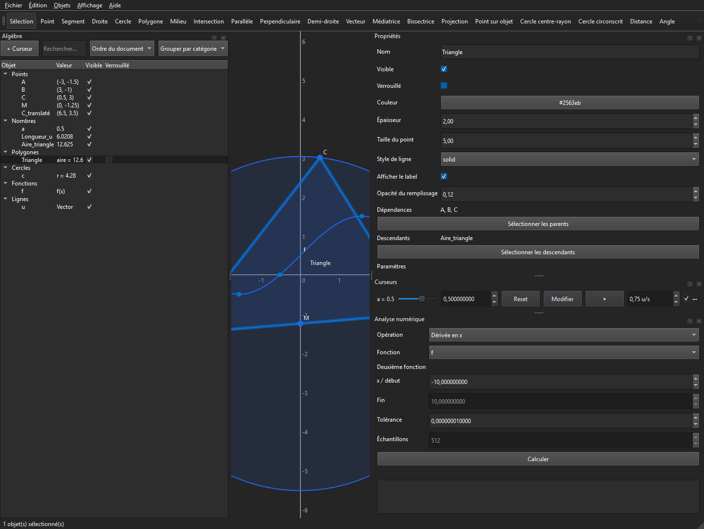

# PyGeoLab

[Français](README.fr.md) · **English**

PyGeoLab 1.1 is a desktop application for **dynamic geometry** and **mathematical visualization**, built with Python and PySide6. It combines dependent constructions, parameterized functions, numerical analysis, and versioned `.pgl` projects in a mouse and keyboard accessible interface.



## Highlights

- snapping to the grid, points, projections, and intersections, with temporary `Alt` suspension;
- advanced rays, vectors, bisectors, projections, circles, measurements, and transformations;
- rectangle and multiple selection, grouped editing, duplication, display order, and overlap cycling;
- searchable and sortable Algebra panel with direct editing, dependencies, and descendants;
- editable functions with adaptive sampling, roots, extrema, intersections, and derivatives;
- editable animated sliders with speed, ping-pong playback, pause, and reset;
- numerical derivatives, integrals, roots, extrema, intersections, and dynamic measurements;
- recent files, atomic autosave, crash recovery, and centralized preferences;
- light and dark themes, documented shortcuts, keyboard navigation, and shareable diagnostics;
- viewport, full-document, or selection export to PNG/SVG and clipboard copy.

Read the [English user guide](docs/user-guide.md) or the [French user guide](docs/user-guide.fr.md).

## Install from a release

Download the archive for your platform from [GitHub Releases](https://github.com/Trycky64/PyGeoLab/releases), extract it, and run `PyGeoLab.exe` on Windows or `PyGeoLab` on Linux. The application automatically uses French on a French system and English elsewhere; the language can also be selected in Preferences.

## Development

PyGeoLab supports Python 3.12 through 3.14.

```bash
python -m venv .venv
python -m pip install -e ".[dev]"
python -m pygeolab
```

On Windows PowerShell, activate the environment with `.\.venv\Scripts\Activate.ps1`. On Linux and macOS, use `source .venv/bin/activate`.

Run the release gate:

```bash
python -m pytest
python -m ruff check .
python -m ruff format --check .
python -m mypy src
```

The noninteractive suite runs with Qt offscreen on Windows and Linux under Python 3.12, 3.13, and 3.14. CI also builds both PyInstaller applications and starts each executable with `--smoke-test`.

## Demo project

Open [`examples/demo.pgl`](examples/demo.pgl) with **File > Open**. It demonstrates a triangle, circle, midpoint, vector, translation, dynamic measurements, animated slider `a`, and `f(x) = sin(x) + a`.

## Desktop builds

```powershell
.\scripts\build-windows.ps1
```

```bash
./scripts/build-linux.sh
```

Each script runs the release gate, builds a portable directory, verifies offscreen startup, and creates the platform archive. Version tags trigger the [release workflow](.github/workflows/release.yml).

## Architecture and security

The [project documentation](docs/README.md) covers the architecture, dependency graph, renderer, persistence, tests, and ADRs. `.pgl` input is validated before reconstruction, and an invalid project cannot replace the current document. The mathematical expression engine uses a closed parser and never calls `eval` or `exec`.

Contributions are described in [CONTRIBUTING.md](CONTRIBUTING.md). Please report vulnerabilities according to [SECURITY.md](SECURITY.md).

## License

MIT — see [LICENSE](LICENSE).
