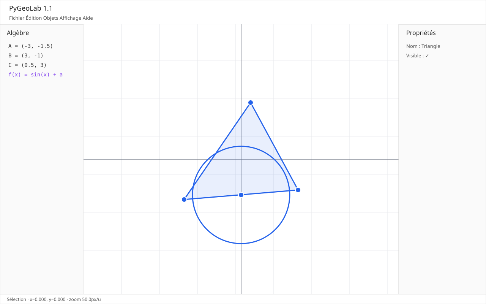

# PyGeoLab

PyGeoLab 1.0 est une application desktop de **géométrie dynamique** et de **visualisation mathématique** développée en Python et PySide6. Elle combine constructions géométriques dépendantes, outils interactifs, expressions mathématiques sécurisées, analyse numérique et projets `.pgl` versionnés.



## Fonctionnalités

- points, segments, droites, cercles, polygones, milieux, intersections, parallèles et perpendiculaires ;
- pan, zoom sous le curseur, grille adaptative, axes et labels ;
- sélection, déplacement des points libres, previews et annulation avec `Escape` ;
- historique Undo/Redo ;
- panneaux Algèbre, Propriétés et Curseurs ;
- variables numériques et sliders liés au graphe de dépendances ;
- parser mathématique fermé, sans exécution arbitraire de code ;
- dérivée, intégration, racines, extrema et intersections numériques ;
- sauvegarde/chargement `.pgl`, validation et migrations ;
- export PNG/SVG, facteur de résolution et fond transparent ;
- thèmes clair/sombre, préférences persistantes et logs rotatifs.

## Installation développeur

Python 3.12 ou supérieur est requis. La CI et les builds de release utilisent Python 3.13.

```powershell
py -m venv .venv
.\.venv\Scripts\Activate.ps1
py -m pip install -e ".[dev]"
py -m pygeolab
```

Sous Linux :

```bash
python -m venv .venv
source .venv/bin/activate
python -m pip install -e '.[dev]'
python -m pygeolab
```

## Vérifications

```powershell
py -m pytest
py -m ruff check .
py -m ruff format --check .
py -m mypy src
```

Pour les tests Qt sans affichage : `QT_QPA_PLATFORM=offscreen`.

## Projet de démonstration

Ouvrir `examples/demo.pgl` depuis **Fichier → Ouvrir**. Il contient trois points, un triangle, un milieu dépendant, un cercle, un curseur `a` et la fonction `f(x)=sin(x)+a` pour vérifier immédiatement le recalcul dynamique.

## Exports

**Fichier → Exporter** permet d'enregistrer le viewport courant en PNG ou SVG. La résolution et le fond transparent par défaut sont configurables dans **Édition → Préférences**.

## Builds desktop

Windows PowerShell 5+ :

```powershell
.\scripts\build-windows.ps1
```

Linux :

```bash
./scripts/build-linux.sh
```

Les tags `v*` déclenchent également `.github/workflows/release.yml`, qui construit les artefacts Windows et Linux puis les joint à la GitHub Release.

## Architecture et documentation

Le cahier des charges, l'architecture, les ADR, les choix de sécurité et le backlog sont dans [`docs/`](docs/README.md). Le format `.pgl` est traité comme une entrée non fiable et validé avant reconstruction. Le moteur mathématique n'utilise jamais `eval` ou `exec`.

## Licence

MIT — voir [LICENSE](LICENSE).
